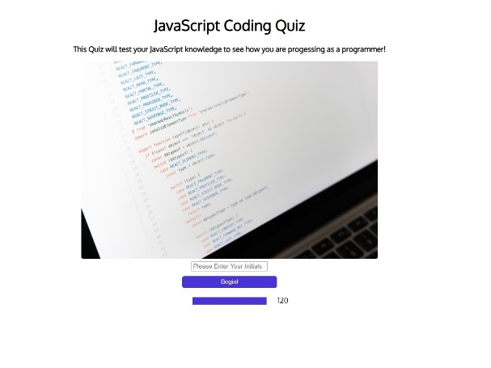
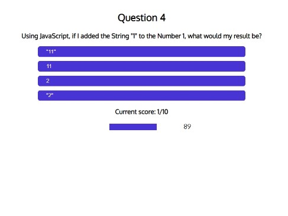

# Coding Quiz

This repository contains a coding quiz created with HTML/CSS which dynamically updates with JavaScript.

The user can play the quiz, which is multiple choice and see their high scores which are locally stored. High scores can be cleared by the user.

The quiz is timed and any incorrect questions will result in the timer being decreased.

## Live page

The password generator is available [here](https://ross-mc.github.io/javascript-coding-quiz/)

## Screenshots

